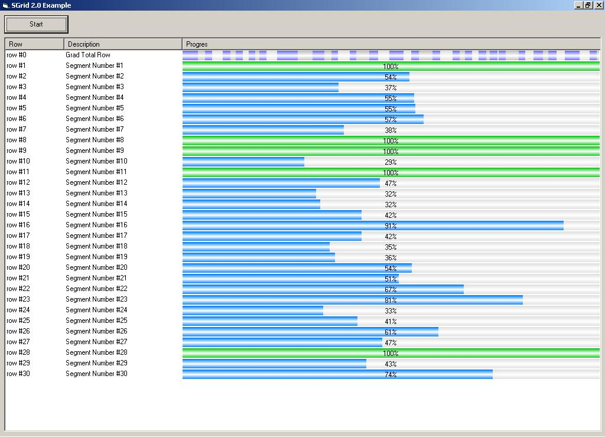



## Segmented Progress Barr

### Description

The purpose of this progress bar is to show progress segmented. Can be used when you have many jobs which have different sizes and values. Can be used like a common progress bar when you have one segment.

I post this code because I didn&#8217;t find this kind of bar on 1VBStreet and also because in that way I can see somebody else opinion. Is a beta version.

I made an extra example using Sgrid 2.0 from vbaccelerator.

Comments are welcome, votes not necessary.
 
### More Info
 

             |
---                |---
**Submitted On**   |2006-10-04 07:20:02
**By**             |[Costinu](https://github.com/Planet-Source-Code/PSCIndex/blob/master/ByAuthor/costinu.md)
**Level**          |Intermediate
**User Rating**    |5.0 (50 globes from 10 users)
**Compatibility**  |VB 6\.0
**Category**       |[Miscellaneous](https://github.com/Planet-Source-Code/PSCIndex/blob/master/ByCategory/miscellaneous__1-1.md)
**World**          |[Visual Basic](https://github.com/Planet-Source-Code/PSCIndex/blob/master/ByWorld/visual-basic.md)
**Archive File**   |[Segmented\_2023141042006\.zip](https://github.com/Planet-Source-Code/costinu-segmented-progress-barr__1-66703/archive/master.zip)

